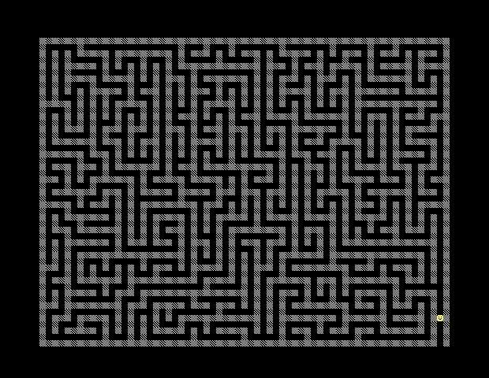
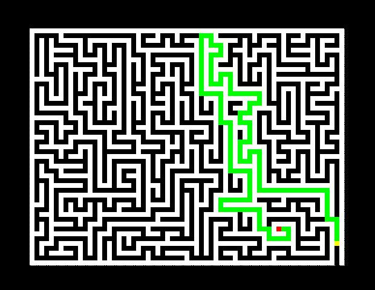
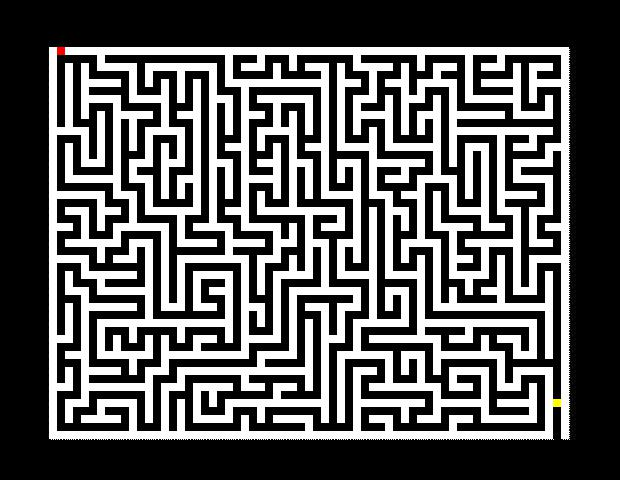

# MATH620165——机器学习与神经网络导论：期末编程题 4

## Introduction

给定迷宫图像（如下），利用 Reinforcement Learning 算法求解迷宫最短路径搜索问题：任意给出终点位置，规划出最短路径，或者告知不能到达。



本项目包含两个部分：

1. 将迷宫图像识别为可解析的数据结构：数组
2. 根据迷宫数组实现求解最短路径的强化学习算法

## Quick Start

```bash
python main.py
```

**令迷宫的左上角格子的坐标为 (0, 0)**，在命令行输入终点的坐标（使用空格分隔横、纵坐标），例如：

```bash
51 41 //有最短路径
1 0   //无最短路径
```

然后等待训练即可，不论是否有最短路径，都会在项目文件夹内保存一张图像`result.jpg`，图像上黄色的格子为起点，红色的格子为终点，绿色的格子代表路径。

如果有最短路径，则会有一条绿色的路径，例如：



如果没有最短路径，则不会有绿色的路径，只有起点和终点的标识，例如：



## Details

`model`：用于存放训练的 agent 的 Q 表

`res`：用于存放迷宫图像、迷宫文本数据文件

`src`：用于存放环境类、Q 学习智能体类和一些其他函数

​	`operations.py`：包含`read_maze()`、`draw_maze()`、`hash()`

​	`MazeEnv.py`：迷宫环境类

​	`QLearningAgent.py`：Q 学习智能体类

`utils`：用于存放一些工具程序，**注意：这里面的程序需要移动至项目目录下运行**

​	`parse.py`：用于将迷宫图像解析为数组

​	`dfs.py`：用于判断某一指定终点的连通性（使用深度优先搜索算法）

`main.py`：主程序

## TODO

可能可以优化一下参数等